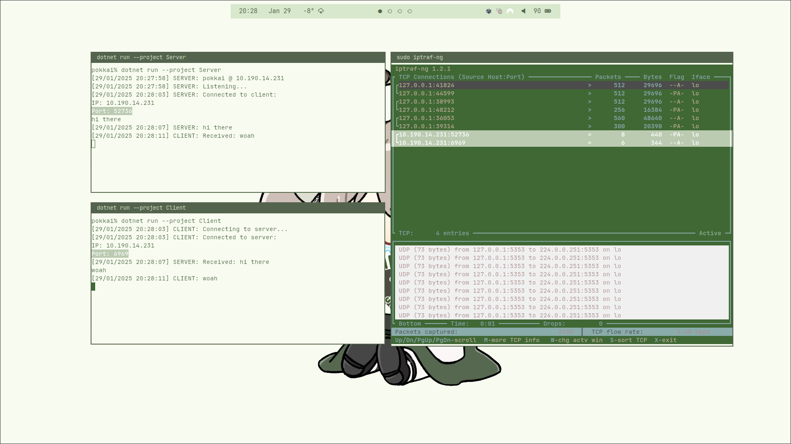

# About
This is a basic TCP chat service that runs on the network.

# Examples

[Video example](https://youtu.be/4f39dKGbxag)

# Usage
Make sure to run the server instance first. The client will not run without a server:
```
# You will need 2 terminal instances for this to work (one for the server, one for the client)

# Terminal 1
dotnet run --project Server

# Terminal 2
dotnet run --project Client
```

Upon connection, you can send whatever messages you want! (except for "exit")

To close a connection, you can use the word "exit", or you can use ctrl+c
